# 技术设计文档：启动时自动导入菜单配置

## 概述

本功能在程序启动阶段（`setup()` 函数中）自动读取 `config/menu_20260416180529.json` 配置文件，将其反序列化为 `dto.MenuPermissionIO` 结构体，然后调用已有的 `service.SysMenu.ImportMenuPermission` 方法将菜单和权限数据导入数据库。

核心设计原则：
- **复用已有服务**：不新建导入逻辑，直接调用 `ImportMenuPermission`
- **不阻塞启动**：所有错误（文件不存在、JSON 解析失败、导入失败、数据库不可用）均记录日志后跳过，不影响程序正常启动
- **执行顺序明确**：在数据库迁移和 SysApi Swagger 同步之后执行，确保数据库表结构和 API 数据已就绪

## 架构

```mermaid
sequenceDiagram
    participant Setup as setup()
    participant Loader as importMenuFromConfig()
    participant FS as 文件系统
    participant JSON as encoding/json
    participant SVC as SysMenu.ImportMenuPermission
    participant DB as 数据库

    Setup->>Setup: 1. 读取配置 & 初始化
    Setup->>Setup: 2. 数据库迁移
    Setup->>Setup: 3. SysApi Swagger 同步
    Setup->>Loader: 4. 调用菜单导入
    Loader->>FS: 读取 menu_20260416180529.json
    alt 文件不存在
        FS-->>Loader: error (os.ErrNotExist)
        Loader->>Loader: log.Warn + return
    end
    FS-->>Loader: 文件内容 ([]byte)
    Loader->>JSON: json.Unmarshal → MenuPermissionIO
    alt JSON 解析失败
        JSON-->>Loader: error
        Loader->>Loader: log.Error + return
    end
    JSON-->>Loader: MenuPermissionIO
    Loader->>SVC: ImportMenuPermission(&data)
    SVC->>DB: 事务：导入权限 + 导入菜单
    alt 导入失败
        SVC-->>Loader: error
        Loader->>Loader: log.Error + return
    end
    SVC-->>Loader: nil
    Loader->>Loader: log.Info("导入成功")
    Loader-->>Setup: return
    Setup->>Setup: 5. 注册监听函数 & 继续启动
```



整体流程嵌入 `setup()` 函数的现有启动链中，位于 SysApi Swagger 同步之后、注册监听函数之前。

## 组件与接口

### 1. importMenuFromConfig 函数

**位置**：`cmd/api/server.go`

**签名**：
```go
func importMenuFromConfig(db *gorm.DB, lg *logger.Helper)
```

**职责**：
- 接收数据库连接和日志实例
- 检查 db 是否为 nil，若为 nil 则记录警告并返回
- 读取配置文件 `menu_20260416180529.json`
- 反序列化为 `dto.MenuPermissionIO`
- 初始化 `service.SysMenu` 实例并调用 `ImportMenuPermission`
- 所有错误均记录日志后返回，不 panic、不返回 error

**设计决策**：
- 函数不返回 error，因为调用方（`setup()`）不需要根据错误做分支处理，所有错误场景的行为一致：记录日志并继续
- 直接接收 `*gorm.DB` 和 `*logger.Helper` 参数，与 `SyncSysApiFromSwagger` 保持一致的调用风格
- 配置文件路径硬编码为 `menu_20260416180529.json`（与 Dockerfile COPY 目标路径一致），不引入额外配置项

### 2. setup() 函数修改

在 `setup()` 中 SysApi Swagger 同步代码块之后、注册监听函数之前，添加菜单导入调用：

```go
// 已有代码：SysApi Swagger 同步
// ...

// 新增：启动时自动导入菜单配置
importMenuFromConfig(db, h)

// 已有代码：注册监听函数
```

注意：`db` 和 `h`（`*logger.Helper`）在 Swagger 同步代码块中已经创建，可直接复用。

### 3. Dockerfile 修改

在现有 COPY 指令区域添加一行：

```dockerfile
COPY config/menu_20260416180529.json ./menu_20260416180529.json
```

### 4. service.SysMenu 初始化方式

在非 HTTP 上下文中初始化 `service.SysMenu`，需要手动设置 `Service` 基础字段：

```go
svc := service.SysMenu{}
svc.Orm = db
svc.Log = lg
```

这与 `common/service/service.go` 中 `Service` 结构体的字段定义一致（`Orm *gorm.DB`、`Log *logger.Helper`）。

## 数据模型

本功能不引入新的数据模型。完全复用已有结构：

### dto.MenuPermissionIO（已有）

```go
type MenuPermissionIO struct {
    Menus       []MenuIO       `json:"menus"`
    Permissions []PermissionIO `json:"permissions"`
}
```

### dto.MenuIO（已有）

包含菜单的所有字段（MenuType、Path、Component、Title、Children 等），支持递归子菜单。

### dto.PermissionIO（已有）

包含权限的 Code、Name、Type 和关联的 API 列表。

### JSON 配置文件结构

`menu_20260416180529.json` 的顶层结构与 `MenuPermissionIO` 完全对应：

```json
{
  "menus": [ ... ],
  "permissions": [ ... ]
}
```

## 正确性属性

*正确性属性是在系统所有有效执行中都应成立的特征或行为——本质上是对系统应做什么的形式化陈述。属性是人类可读规格说明与机器可验证正确性保证之间的桥梁。*

### 属性 1：MenuPermissionIO JSON 序列化往返

*对于任意*有效的 `MenuPermissionIO` 结构体，将其序列化为 JSON 再反序列化回 `MenuPermissionIO`，应产生与原始结构体等价的值。

**验证需求：3.1**

### 属性 2：JSON 结构验证正确性

*对于任意* JSON 字节流，如果其顶层结构包含 `menus` 数组和 `permissions` 数组且类型正确，则反序列化为 `MenuPermissionIO` 应成功且不返回错误；如果顶层结构缺少这些字段或类型不匹配，则反序列化后的结构体应包含零值（空切片或 nil）。

**验证需求：1.2, 3.1**

## 错误处理

所有错误场景均遵循「记录日志 + 跳过导入 + 继续启动」的策略：

| 错误场景 | 日志级别 | 日志内容 | 行为 |
|---------|---------|---------|------|
| 数据库连接为 nil | Warn | `启动时菜单导入跳过：数据库连接为空` | 直接返回 |
| 配置文件不存在 | Warn | `启动时菜单导入跳过：配置文件不存在 %s` | 直接返回 |
| JSON 解析失败 | Error | `启动时菜单导入失败：JSON解析错误 %v` | 直接返回 |
| ImportMenuPermission 返回错误 | Error | `启动时菜单导入失败: %v` | 直接返回 |
| 导入成功 | Info | `启动时菜单导入完成` | 继续执行 |

**设计决策**：
- 文件不存在使用 `Warn` 级别，因为这可能是有意为之（某些环境不需要菜单导入）
- JSON 解析失败和导入失败使用 `Error` 级别，因为这表示配置文件有问题，需要关注
- 使用 `os.IsNotExist(err)` 区分「文件不存在」和「其他读取错误」

## 测试策略

### 属性测试（Property-Based Testing）

使用 [rapid](https://github.com/flyingmutant/rapid) 库（Go 语言主流 PBT 库）进行属性测试。

每个属性测试配置最少 100 次迭代。每个测试通过注释标注对应的设计属性：

- **标签格式**：`Feature: auto-import-menu, Property {number}: {property_text}`

#### 属性测试 1：MenuPermissionIO JSON 往返

生成随机的 `MenuPermissionIO` 结构体（包含随机数量的菜单和权限，菜单支持随机深度的子菜单树），序列化为 JSON 后反序列化，验证结果与原始值深度相等。

#### 属性测试 2：JSON 结构验证

生成随机的 JSON 字节流（包括有效结构、缺少字段、类型错误等），反序列化为 `MenuPermissionIO`，验证：
- 有效结构能正确解析
- 无效结构不会导致 panic，且结果为零值

### 单元测试

针对 `importMenuFromConfig` 函数的具体场景：

1. **文件不存在**：传入不存在的文件路径，验证函数正常返回且不 panic
2. **无效 JSON**：创建包含无效 JSON 的临时文件，验证函数记录错误日志并正常返回
3. **数据库连接为 nil**：传入 nil db，验证函数记录警告并正常返回
4. **正常导入**：使用有效的 JSON 文件和 mock/test 数据库，验证 `ImportMenuPermission` 被正确调用

### 集成测试

1. **Dockerfile 验证**：检查 Dockerfile 包含正确的 COPY 指令
2. **启动顺序验证**：检查 `setup()` 中菜单导入位于 Swagger 同步之后
